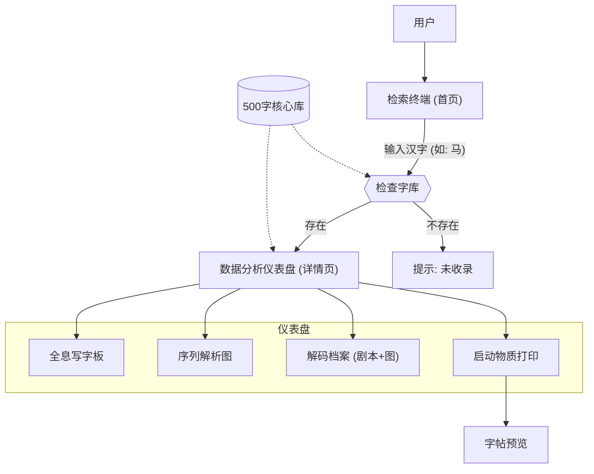

# 汉字学习终端构建计划

本计划旨在创建一个专注于汉字笔顺与文化内涵的学习应用。UI 设计采用“汉字太空站”科技风格。首页改为**搜索驱动**，后台维护 **500 个常用高频汉字** 的数据库。

## 1. 项目初始化与架构

- 使用 `npm create vite@latest` 初始化 Vue 3 + TypeScript 项目。
- 配置 Tailwind CSS 以快速构建现代 UI。
- 安装核心依赖：`hanzi-writer` (笔顺动画), `vue-router` (页面导航), `pinia` (可选，用于状态管理)。

## 2. 数据结构设计

- 创建静态数据文件 [`src/data/hanzi-db.ts`](src/data/hanzi-db.ts)。
- **数据规模**：包含 **500 个** 常用高频汉字。
- **数据字段定义**：
  - `char`: 汉字 (索引键)
  - `pinyin`: 拼音
  - `radicals`: 部首拆解
  - `script`: **儿童速记剧本** (拆解法 + 故事联想)
  - `image`: 配图 URL
  - `tags`: 标签 (如 "高频", "动物", "数字") - 辅助搜索
- **生成策略**：
  - 建立 500 字的基础列表。
  - 为前 20-50 个字生成高质量的完整剧本与配图作为演示。
  - 剩余汉字生成基础骨架，剧本内容暂填占位符或通过 AI 批量生成填入。

## 3. 核心功能实现

### A. 首页：检索终端 (Search Portal)

- 文件：[`src/views/HomeView.vue`](src/views/HomeView.vue)
- **布局**：
  - 页面中央放置巨大的、科技感十足的**搜索/输入框** (类似于“启动核心”或“输入指令”)。
  - 背景：动态星空或流动的代码流（矩阵效果），营造神秘科技感。
  - 交互：输入汉字后，按回车或点击“扫描/分析”按钮跳转至详情页。
  - *可选*：底部提供“随机推荐”或“每日一字”的小入口。

### B. 组件：全息写字板 (Hanzi Demo)

- 文件：[`src/components/HanziDemo.vue`](src/components/HanziDemo.vue)
- 样式：笔画颜色使用电光蓝/激光绿，背景为全息网格，模拟“扫描分析”过程。

### C. 组件：数据解析区

- 文件：[`src/components/StrokeSequence.vue`](src/components/StrokeSequence.vue)
- 文件：[`src/views/DetailView.vue`](src/views/DetailView.vue)
- **布局**：
  - 详情页设计为“分析结果仪表盘”。
  - 左侧：全息写字板（动态）。
  - 右侧/下方：剧本解码区（打字机效果显示剧本）、字源影像（配图）。

### D. 字帖生成

- 文件：[`src/views/PrintSheet.vue`](src/views/PrintSheet.vue)
- 功能：支持当前汉字生成 A4 打印字帖。UI 上设计为“物质打印协议”。

## 架构图 (Mermaid)

